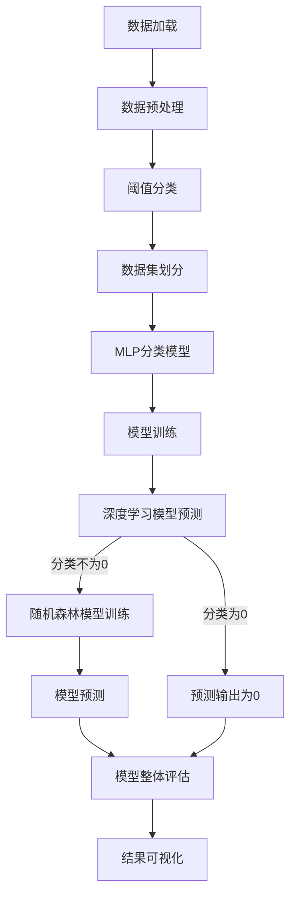

# 说明文档

## 1. 简介

- 该代码用于执行一个负荷预测任务，包括数据预处理、模型训练和评估等步骤。主要采用了深度学习模型（MLP）和随机森林模型的结合。以下是对代码中各个部分的详细说明。

## 2. 数据预处理

### 2.1 数据加载

- 使用`pandas`库读取Excel文件，加载负荷预测数据，并定义了新的列名。

### 2.2 日期时间解析

- 对"记录时间"列进行处理，转换为日期时间类型，并提取月、日、星期和小时等信息。

### 2.3 阈值分类

- 通过设定阈值，将目标变量（`hourly_load`）划分为两个类别（0和1），用于后续的二分类任务。
- 根据甲方提供数据，此处将阈值设定为300

### 2.4 数据集划分

- 将数据集划分为训练集和测试集，同时对目标变量进行阈值分类。

### 2.5 数据转换

- 将数据转换为PyTorch张量，为后续深度学习模型的训练准备数据。

## 3. 模型结构

### 3.1 模型概述

- 本模型是一个组合模型，包括了一个深度学习网络结构和随机森林模型，其中
  - 深度学习MLP用于分类，预测该条输入是否在阈值300以下，若在300以下，直接将模型预测输出为0
  - 随机森林模型用于预测负荷大于300的数据，输入相应的维度参数，预测负荷输出

### 3.2 深度学习MLP分类模型

- 该模型定义了一个包含两个隐藏层的多层感知机（MLP）模型。

- 使用PyTorch进行模型训练，采用Adam优化器和交叉熵损失函数。

### 3.3 随机森林模型

- 随机森林预测部分对深度学习模型预测结果不为0的样本进行随机森林模型的训练。

- 使用随机森林模型对测试集进行预测，并输出R方、MAE、MSE和RMSE等评估指标。

## 4. 算法流程

- 代码流程用mermaid展示如下

## 5. 模型综合效果评估

### 5.1 深度学习模型预测

- 将深度学习模型的输出结果与随机森林模型的预测结果结合，进行最终的负荷预测。

### 5.2 效果评估

- 输出模型综合效果的评估指标，包括R方、MAE、MSE、RMSE和平均百分比误差等。

## 6. 结果可视化

- 绘制了真实值与预测值的散点图，展示了MLP和RandomForest的联合效果。

## 7. 总结

- 该模型综合了深度学习和随机森林两种模型的优势，通过阈值分类实现了对负荷的更精细预测。最终输出了综合模型的效果，并对错误预测进行了分析。
